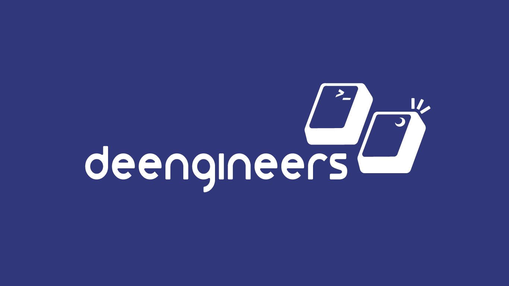

#### This FAQ is WIP

We are still working on this. If you wish to contribute, check out [Contributing](./CONTRIBUTING.md)

  
  <!--  -->

## :small_blue_diamond: FAQ - A list of frequently asked questions by the community

Who are you?

 

Answer: We are ...

What do we do?

 

Answer: We are ...

## CV

Can you give me some CV tips?

### **How to write projects on your CVs:**

- **Summary** (summarise in a line or two what was achieved)
- **Impact** (Was the result scalable, highly available etc.)
- **Technologies** (Mention specific cloud or other technologies used - buzzwords)

This creates a coherent, concise, and dense paragraph for each project. Keep it to no more than 4 lines if you can help it.

**Example:**

> 3-Tier Python App Hosted on Azure App Service Deployed w/ Azure DevOps Pipelines
 

--- 

### **How to write points for your work experience section:**

- **Specific** - Mention a very particular situation/case/ticket/project you worked on: "Configured Multifactor Authentication for 10000+ employees"
- **Impact** (The result/outcome. This can be combined inside the specific point) 
- **Past tense** (All experience points should be written as (if) you have DONE them. Change "Creating, Producing..." -> "Created, Produced..."
- **Verbs** at the beginning of each point (see above^)
- **Technologies** (i.e. Buzzwords - this one is for the recruiters. Recruiters search for profiles (CVs/Linkedins) by key terms from their clients. Terraform, AWS, etc. Name particular technologies throughout your experience points: "Designed an Azure DevOps Board for team-wide task management, replacing shift report")

Some examples:
> Assisted Multi-factor Authentication implementation company-wide (piloting, user rollout and troubleshooting common MFA issues).
> Automated the remediation of FRS service for DCs (post-script PowerShell onAzure Site Recovery - Failover Recovery Plans).
> Successfully introduced ARM template validation in CI/CD pipelines (before) deployment to Azure.

---

### **How to write profiles:**

- State your role and company: *"Azure Engineer for DPD Global."*
- State your top 3 technical skills: (with key technology buzzwords): *"Skilled in Azure administration, ARM and Azure DevOps."*
- State 3 technologies you want to build skills in: *"Interested in building skills in Kubernetes, Terraform and Ansible"*

**Example:**

>"Azure Engineer for DPD Global. Skilled in Azure administration, ARM and Azure DevOps. Interested in building skills in Kubernetes, Terraform and Ansible."

That is all you need. Recruiters and hiring managers are lazy and must go through a bunch of CVs. Get straight to the point and mention everything without a wasted word or letter. No one needs a heartbreaking story. Also, you will save space for points in later stages of your CV.

Rule of 3 is a great writing technique you may remember from English classes. Only include buzzwords from jobs you're looking to apply to. 

So, for example, if a person want to go into an Azure Engineer role, then they should highlight skills that they're good at that fit that role. Additionally, recruiters search for CVs and profiles based on keywords. In the final section of a CV, mentioned at least 3 technologies for the job roles that are being looked at. If, for exmaple, the role mentioned Terraform, then that should also be mentioned in the interest in build skills in section on the CV.

### AVOID:
**Cliches** - >"I am a hardworking, passionate individual..." 

This does not add much if it is not backed up by evidence.

**Waffle** 
> "A calm and pragmatic negotiator capable of adapting to last minute change..." 

Avoid big words and keep the reading level low and it makes for an easier read for a busy recruiter!

**Too general**
>"...including creating background operational processes which are critical to the success of large-scale high-profile events." 

Where's the example? Point is you wouldn't have space for an example. The example is required, otherwise it's useless. Plus you can explain these things in an interview / work experience section.

## Interview 

- [Interview related questions](./interview/README.md)

## Other questions and links

